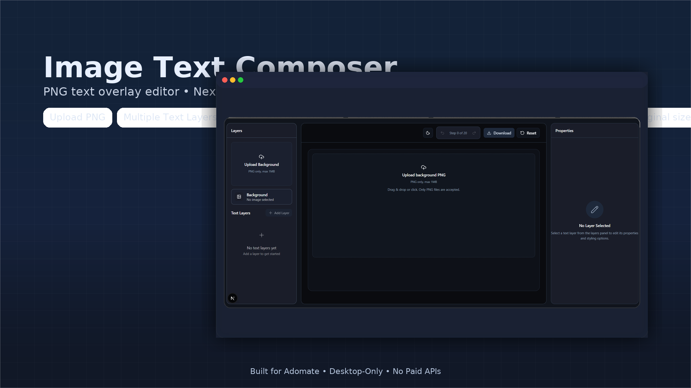

Here’s a clean, production-style README.md you can drop into your repo.

Image Text Composer

A desktop-only, single-page editor for overlaying fully customizable text on PNG images. Built with Next.js + TypeScript, Konva for canvas interactions, and Zustand for state.

Repo: https://github.com/CaesarBourne/AdomateImage
Video walkthrough: https://drive.google.com/file/d/1cLmlyOTva-s0pLvDJCdTI_68xa_NGXyR/view?usp=sharing
Live demo: add your Vercel URL here

Table of contents

Features
Screenshots
Quick start
Environment variables
How it works
Project structure
Keyboard & snapping
Design decisions
Performance notes
Roadmap
Development
Contributing
License

Features

PNG upload — canvas matches the image’s aspect ratio; exports at original dimensions.
Multiple text layers — add, select, drag, rotate, reorder, lock.
Typography — Google Fonts (dynamic catalog), font size, weight, opacity, alignment, multi-line text.
Layer management — left panel with inline text edit and drag-to-reorder.
Snap & nudge — snap to canvas center/edges; arrow-key nudging.
Undo/Redo — ≥ 20 steps with snapshot history.
Autosave — design is stored in localStorage and restored on reload.
Export to PNG — renders at original image size regardless of on-screen scale.
Canvas meta bar — shows Original / On-screen / Export dimensions (e.g. 1200×628 px).

Non-goals per brief: mobile/touch UI, collaboration, non-PNG formats.

Screenshots

Replace these with real screenshots in /public.

Editor UI
Export size chip

Quick start

git clone https://github.com/CaesarBourne/AdomateImage.git
cd AdomateImage
npm install

Create .env.local (see Environment variables below), then:

npm run dev       # http://localhost:3000
npm run build
npm run start
npm run lint

Deploy to Vercel, add the same env vars there.

Environment variables

Two ways to get Google Fonts metadata:

1. Recommended — server-side proxy (keeps your key off the client)

GOOGLE_FONTS_API_KEY=your-google-fonts-key

Used by src/app/api/fonts/route.ts to fetch:
https://www.googleapis.com/webfonts/v1/webfonts?sort=popularity&key=…

2. Simple demo — client-side (key is public)

NEXT_PUBLIC_GOOGLE_FONTS_API_KEY=your-google-fonts-key

Used by src/store/fontStore.ts via lib/googleFonts.ts.

You can enable either or both. The app prefers the server route when present.

How it works

Coordinate system

All geometry and typography are stored in original image pixels:

TextLayer: { x, y, width?, rotation, fontSize, ... }
The view layer computes a display scale to fit the image in the viewport.
Konva renders at display scale; export renders off-screen at original size.

Fonts

/api/fonts/route.ts fetches the live Google Fonts catalog (server-side).
useGoogleFonts() caches the catalog in localStorage.
useFontLoader() (WebFont Loader) loads only the currently selected family/weights.

Export

useExportOriginal() calls exportPNGOriginal() to render at (originalW × originalH).
A small meta bar above the canvas shows Original / On-screen / Export sizes to verify correctness.

Project structure

AdomateImage
├── public
├── src
│   ├── app
│   │   ├── api/fonts/route.ts
│   │   ├── globals.css
│   │   ├── layout.tsx
│   │   └── page.tsx
│   ├── components
│   │   ├── editor
│   │   │   ├── canvas
│   │   │   │   ├── CanvasMetaBar.tsx
│   │   │   │   ├── CanvasStage.tsx
│   │   │   │   ├── FileDropTarget.tsx
│   │   │   │   └── TextNode.tsx
│   │   │   ├── left/LayersPanel.tsx
│   │   │   ├── right/propertiesPanel
│   │   │   │   ├── AlignmentControls.tsx
│   │   │   │   ├── AppearanceControls.tsx
│   │   │   │   ├── PropertiesPanel.tsx
│   │   │   │   ├── Section.tsx
│   │   │   │   ├── TransformControls.tsx
│   │   │   │   └── TypographyControls.tsx
│   │   │   ├── top/CanvasToolbar.tsx
│   │   │   └── EditorPage.tsx
│   │   ├── theme-provider
│   │   └── ui/… (shadcn/ui)
│   ├── hooks
│   │   ├── useExportOriginal.ts
│   │   ├── useFontLoader.ts
│   │   ├── useGoogleFonts.ts
│   │   └── useViewportBox.ts
│   ├── lib
│   │   ├── coords.ts
│   │   ├── export.ts
│   │   ├── format.ts
│   │   ├── googleFonts.ts
│   │   ├── image.ts
│   │   ├── layout.ts
│   │   └── utils.ts
│   ├── store
│   │   ├── editorStore.ts
│   │   └── fontStore.ts
│   └── types
│       └── editor.ts
├── next.config.ts
├── tsconfig.json
└── README.md

Keyboard & snapping

Nudge: Arrow keys move the selected text layer by 1px
Fast nudge: Shift + Arrow = 10px
Snap to edges: Ctrl + Arrow (left/right/top/bottom)
Snap to center: Ctrl+Alt+Left (center X), Ctrl+Alt+Up (center Y)
Undo / Redo: Ctrl+Z / Ctrl+Shift+Z (or Cmd on macOS)

Snapping is done against the canvas bounds in original pixel space, then scaled for display.

Design decisions

Konva instead of raw Canvas/Fabric — robust text + selection/drag events, React bindings.
Zustand for state — small, predictable, easy to snapshot for undo/redo.
Original-pixel model — guarantees export accuracy and simplifies scale math.
Server font proxy — avoids shipping keys to the client in production.

Performance notes

Only the currently selected font family/weights are loaded (WebFont Loader).
Google Fonts catalog is cached in localStorage (fast subsequent loads).
First load may briefly show Chrome “fallback font used” warnings until fonts are cached (normal).

Roadmap

Line-height and letter-spacing controls
Text shadow (color, blur, offsets)
Multi-select with group transforms
Alignment guides and spacing hints
Curved / warped text along a path
Tests (unit and E2E)

Development

Code style: TypeScript, ESLint, shadcn/ui components
State updates: Every destructive change pushes a snapshot for history; view-only updates (like resize/fit) do not pollute history.
SEO: Title/description in app/layout.tsx via export const metadata, preconnect/dns-prefetch for Google Fonts, theme hydration opt-in.

Contributing

PRs welcome!

Fork & branch from main
npm i && npm run dev
Keep PRs focused (one feature/fix)
npm run lint before pushing

New controls typically live in components/editor/right/propertiesPanel and are wired via PropertiesPanel.tsx.

License

MIT — see LICENSE (feel free to add one if missing).
